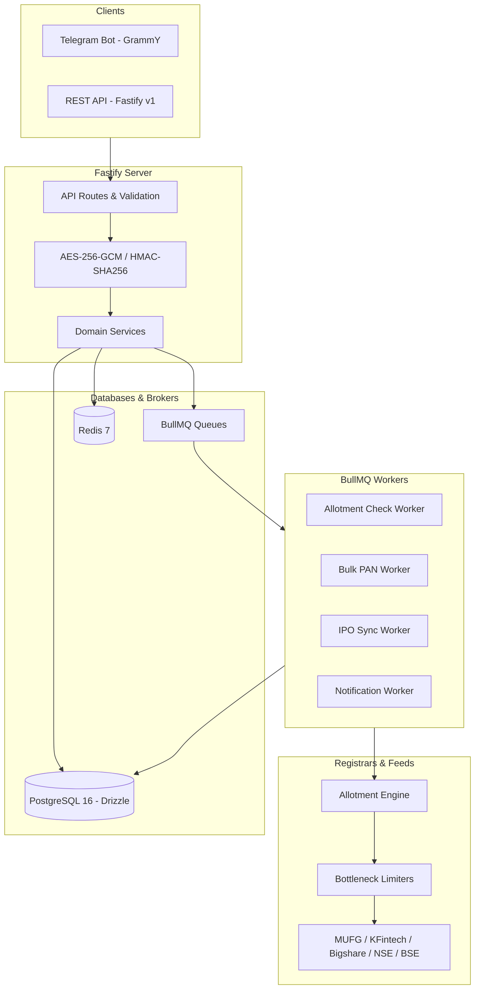

# Indian IPO Intelligence, PAN Allotment Checker & Notification Platform

Production-grade Indian IPO intelligence and PAN allotment monitoring platform built with **Node.js 22+, TypeScript, Fastify, PostgreSQL (Drizzle ORM), Redis, BullMQ, Telegram Bot (GrammY), and Pushover**.

---

## Key Features

- **Multi-PAN Allotment Verification**: Query single or batch PAN applications across active Indian IPOs.
- **Provider Abstraction Layer**: Pluggable adapters for Indian registrars (MUFG Intime / Link Intime, KFintech, Bigshare) and exchanges (NSE, BSE, Upstox).
- **Zero-Plaintext PAN Security**:
  - Encrypted at rest using **AES-256-GCM** (96-bit random IV, 128-bit auth tag).
  - Search indexed with **HMAC-SHA256**.
  - Automatic zero-PAN log redaction via Pino serializers.
  - Masked UI representation (`XXXXX1234F`).
- **High-Throughput Bulk Processing**: Asynchronous batch job queuing via BullMQ capable of processing up to 1,000 PANs with concurrency limits.
- **Result Change Detection & Deduplication**:
  - Deterministic state change hashing `sha256(panHash + ipoId + status + allottedQuantity + issuePrice)`.
  - Notification deduplication suppressing redundant polling alerts.
- **Multi-Channel Outbound Notifications**:
  - Instant Telegram Bot cards with inline keyboards.
  - Pushover push notifications with priority levels.
- **Production DevOps & Observability**:
  - Multi-stage Docker build.
  - Health (`/health`) and Readiness (`/ready`) probes.
  - OpenAPI 3.0 / Swagger documentation at `/docs`.

---

## Architecture Overview



---

## Prerequisites

- **Node.js**: v22.0.0 or higher
- **npm**: v10.0.0 or higher
- **PostgreSQL**: v16+ (or via Docker Compose)
- **Redis**: v7+ (or via Docker Compose)

---

## Quick Start (Local Development)

### 1. Clone and Install Dependencies
```bash
git clone <repo-url>
cd ipo
npm install
```

### 2. Configure Environment Variables
Copy `.env.example` to `.env` and fill in secrets:
```bash
cp .env.example .env
```

Generate 32-byte encryption keys:
```bash
node -e "console.log(require('crypto').randomBytes(32).toString('hex'))"
```

### 3. Start Database & Redis via Docker
```bash
docker compose up -d postgres redis
```

### 4. Run Migrations & Seed Sample IPO Data
```bash
npm run db:migrate
npm run db:seed
```

### 5. Start Server and Background Workers
In Terminal 1 (HTTP Server):
```bash
npm run dev
```

In Terminal 2 (BullMQ Workers):
```bash
npm run dev:worker
```

Open Swagger API Documentation: [http://localhost:3000/docs](http://localhost:3000/docs)

---

## Running Full Stack in Docker

Run all services (`app`, `worker`, `postgres`, `redis`) with a single command:
```bash
docker compose up --build -d
```

Check service health:
```bash
curl http://localhost:3000/health
curl http://localhost:3000/ready
```

---

## Telegram Bot Commands

| Command | Description |
| :--- | :--- |
| `/start` | Launch bot with interactive menu |
| `/check <PAN>` | Verify single PAN across active IPOs |
| `/bulk` | Start bulk check flow (upload `.txt` or `.csv`) |
| `/history <PAN>` | View allotment analytics & portfolio stats |
| `/ipos` | Explore active & upcoming IPOs with GMP |
| `/watch <PAN>` | Register automatic allotment monitoring |
| `/admin` | System health & stats (Authorized Admins only) |

---

## Running Tests

Execute the comprehensive Vitest test suite:
```bash
npm test
```

Includes:
- Unit tests for PAN cryptography, hashing, masking, and validation.
- Unit tests for deterministic result & notification fingerprinting.
- Exponential backoff with jitter retry tests.
- Bulk CSV / TXT parsing tests.
- 10-state provider contract compliance tests.
- Fastify REST API integration tests.

---

## License & Legal Guardrails

This application is designed for authorized personal and enterprise IPO monitoring. It complies with zero-bot bypass policies, respects registrar rate limits, and prioritizes official interfaces.
