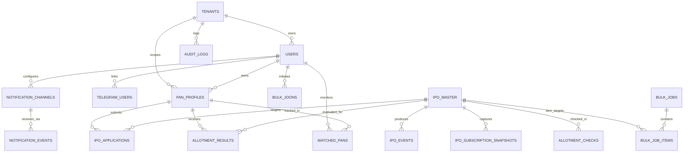

# Database Entity Relationship Diagram (ERD)

## Conceptual ERD

## Detailed Schema Specification

### 1. `tenants`
- `id` (UUID, PK)
- `name` (VARCHAR, Not Null)
- `slug` (VARCHAR, Unique, Not Null)
- `is_active` (BOOLEAN, Default: true)
- `created_at` (TIMESTAMPTZ, Default: NOW())
- `updated_at` (TIMESTAMPTZ, Default: NOW())

### 2. `users`
- `id` (UUID, PK)
- `tenant_id` (UUID, FK -> tenants.id)
- `email` (VARCHAR, Unique, Nullable)
- `role` (VARCHAR, 'admin' | 'user', Default: 'user')
- `api_key_hash` (VARCHAR, Nullable)
- `created_at` (TIMESTAMPTZ, Default: NOW())
- `updated_at` (TIMESTAMPTZ, Default: NOW())

### 3. `telegram_users`
- `id` (UUID, PK)
- `user_id` (UUID, FK -> users.id)
- `telegram_id` (BIGINT, Unique, Not Null)
- `username` (VARCHAR, Nullable)
- `first_name` (VARCHAR, Nullable)
- `last_name` (VARCHAR, Nullable)
- `is_admin` (BOOLEAN, Default: false)
- `is_blocked` (BOOLEAN, Default: false)
- `created_at` (TIMESTAMPTZ, Default: NOW())
- `updated_at` (TIMESTAMPTZ, Default: NOW())

### 4. `pan_profiles`
- `id` (UUID, PK)
- `tenant_id` (UUID, FK -> tenants.id)
- `owner_user_id` (UUID, FK -> users.id)
- `label` (VARCHAR, Nullable)
- `pan_encrypted` (TEXT, Not Null) - AES-256-GCM ciphertext
- `pan_hash` (VARCHAR, Not Null) - HMAC-SHA256 indexable hash
- `pan_last4` (VARCHAR(4), Not Null) - Last 4 characters for display
- `is_active` (BOOLEAN, Default: true)
- `created_at` (TIMESTAMPTZ, Default: NOW())
- `updated_at` (TIMESTAMPTZ, Default: NOW())
- *Index*: `(pan_hash, owner_user_id)`

### 5. `ipo_master`
- `id` (UUID, PK)
- `symbol` (VARCHAR, Not Null)
- `company_name` (VARCHAR, Not Null)
- `slug` (VARCHAR, Unique, Not Null)
- `isin` (VARCHAR, Nullable)
- `exchange` (VARCHAR, 'NSE' | 'BSE' | 'BOTH', Default: 'NSE')
- `issue_type` (VARCHAR, 'BOOK_BUILT' | 'FIXED_PRICE', Default: 'BOOK_BUILT')
- `mainboard_or_sme` (VARCHAR, 'MAINBOARD' | 'SME', Default: 'MAINBOARD')
- `status` (VARCHAR, 'UPCOMING' | 'OPEN' | 'CLOSED' | 'ALLOTMENT_PENDING' | 'ALLOTTED' | 'LISTED' | 'COMPLETED' | 'WITHDRAWN', Default: 'UPCOMING')
- `open_date` (TIMESTAMPTZ, Nullable)
- `close_date` (TIMESTAMPTZ, Nullable)
- `allotment_date` (TIMESTAMPTZ, Nullable)
- `refund_date` (TIMESTAMPTZ, Nullable)
- `demat_credit_date` (TIMESTAMPTZ, Nullable)
- `listing_date` (TIMESTAMPTZ, Nullable)
- `face_value` (NUMERIC(10,2), Nullable)
- `price_band_min` (NUMERIC(10,2), Nullable)
- `price_band_max` (NUMERIC(10,2), Nullable)
- `issue_price` (NUMERIC(10,2), Nullable)
- `lot_size` (INTEGER, Default: 1)
- `minimum_application` (INTEGER, Default: 1)
- `issue_size` (NUMERIC(15,2), Nullable) - In Crores/INR
- `registrar` (VARCHAR, Nullable) - e.g. 'MUFG_INTIME', 'KFINTECH', 'BIGSHARE'
- `registrar_url` (VARCHAR, Nullable)
- `subscription_qib` (NUMERIC(8,2), Default: 0)
- `subscription_nii` (NUMERIC(8,2), Default: 0)
- `subscription_retail` (NUMERIC(8,2), Default: 0)
- `subscription_employee` (NUMERIC(8,2), Default: 0)
- `subscription_total` (NUMERIC(8,2), Default: 0)
- `gmp` (NUMERIC(10,2), Default: 0)
- `gmp_percentage` (NUMERIC(6,2), Default: 0)
- `source` (VARCHAR, Default: 'SYSTEM')
- `source_updated_at` (TIMESTAMPTZ, Nullable)
- `created_at` (TIMESTAMPTZ, Default: NOW())
- `updated_at` (TIMESTAMPTZ, Default: NOW())
- *Index*: `(status, open_date, close_date)`

### 6. `allotment_results`
- `id` (UUID, PK)
- `pan_profile_id` (UUID, FK -> pan_profiles.id, Nullable)
- `pan_hash` (VARCHAR, Not Null)
- `ipo_id` (UUID, FK -> ipo_master.id, Not Null)
- `application_number` (VARCHAR, Nullable)
- `status` (VARCHAR, 'ALLOTTED' | 'NOT_ALLOTTED' | 'PENDING' | 'NOT_FOUND' | 'ERROR' | 'UNKNOWN')
- `applied_quantity` (INTEGER, Default: 0)
- `allotted_quantity` (INTEGER, Default: 0)
- `issue_price` (NUMERIC(10,2), Default: 0)
- `amount_applied` (NUMERIC(12,2), Default: 0)
- `amount_allotted` (NUMERIC(12,2), Default: 0)
- `refund_amount` (NUMERIC(12,2), Default: 0)
- `demat_credit_status` (VARCHAR, Nullable)
- `source` (VARCHAR, Not Null)
- `confidence` (VARCHAR, 'HIGH' | 'MEDIUM' | 'LOW', Default: 'HIGH')
- `raw_reference` (TEXT, Nullable)
- `fingerprint` (VARCHAR(64), Not Null)
- `checked_at` (TIMESTAMPTZ, Default: NOW())
- `created_at` (TIMESTAMPTZ, Default: NOW())
- `updated_at` (TIMESTAMPTZ, Default: NOW())
- *Index*: `(pan_hash, ipo_id, checked_at)`
- *Index*: `(fingerprint)`

### 7. `allotment_checks` (Audit & Telemetry of Raw Calls)
- `id` (UUID, PK)
- `pan_hash` (VARCHAR, Not Null)
- `ipo_id` (UUID, FK -> ipo_master.id, Nullable)
- `provider` (VARCHAR, Not Null)
- `status` (VARCHAR, Not Null)
- `raw_response` (JSONB, Nullable)
- `duration_ms` (INTEGER, Not Null)
- `error_code` (VARCHAR, Nullable)
- `created_at` (TIMESTAMPTZ, Default: NOW())

### 8. `bulk_jobs` & `bulk_job_items`
- `bulk_jobs`: `id`, `user_id`, `total_pans`, `processed_pans`, `successful_pans`, `partial_pans`, `failed_pans`, `allotted_count`, `not_allotted_count`, `pending_count`, `status`, `error_message`, `started_at`, `completed_at`, `created_at`
- `bulk_job_items`: `id`, `bulk_job_id`, `pan_hash`, `pan_last4`, `label`, `status`, `allotted_ipos_count`, `error_message`, `processed_at`

### 9. `notification_channels` & `notification_events`
- `notification_channels`: `id`, `user_id`, `telegram_chat_id`, `pushover_user_key`, `pushover_device`, `preferences_json`, `is_active`, `created_at`
- `notification_events`: `id`, `user_id`, `pan_hash`, `ipo_id`, `event_type`, `fingerprint`, `channel`, `payload_json`, `sent_at`
- *Unique Constraint*: `(fingerprint, channel, user_id)`

### 10. `provider_health`
- `provider` (VARCHAR, PK)
- `success_count` (BIGINT, Default: 0)
- `failure_count` (BIGINT, Default: 0)
- `consecutive_failures` (INTEGER, Default: 0)
- `latency_ms` (INTEGER, Default: 0)
- `last_success_at` (TIMESTAMPTZ, Nullable)
- `last_failure_at` (TIMESTAMPTZ, Nullable)
- `status` (VARCHAR, 'HEALTHY' | 'DEGRADED' | 'UNAVAILABLE', Default: 'HEALTHY')
- `updated_at` (TIMESTAMPTZ, Default: NOW())

### 11. `audit_logs`
- `id` (UUID, PK)
- `tenant_id` (UUID, Nullable)
- `user_id` (UUID, Nullable)
- `action` (VARCHAR, Not Null)
- `entity_type` (VARCHAR, Not Null)
- `entity_id` (VARCHAR, Nullable)
- `details` (JSONB, Nullable)
- `ip_address` (VARCHAR, Nullable)
- `created_at` (TIMESTAMPTZ, Default: NOW())
